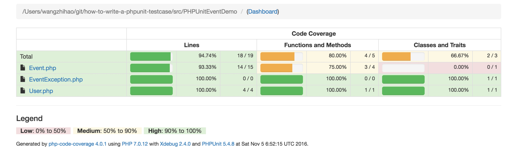
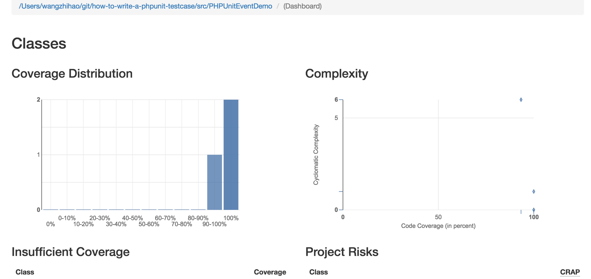

### 使用方法

1. composer install
2. phpunit tests/EventTest.php

### 背景

https://phpunit.de/manual/current/zh_cn/index.html 这个是phpunit的文档,但是看完了我完全不知道怎么入手好吗,从0到1这个过程就在下面。

### 综述

目录结构

```
.
|-- reports
|-- src
|   -- PHPUnitEventDemo
|      -- Event.php
|      -- EventException.php
|      -- User.php
|-- tests
|   -- EventTest.php
|-- .gitignore
|-- composer.json
|-- phpunit.xml
|-- README.md
```

* PHPUnitEventDemo - 下面是要测试的类
	* Event.php - Event类
	* EventException.php - Event异常类
	* User.php - User类
* tests - 单元测试目录
	* EventTest.php - 测试Event类的测试用例

#### Assertions（断言）

断言为PHPUnit的主要功能，用来验证单元的执行结果是不是预期值。

例子:

```
assertTrue(true);   # SUCCESSFUL
assertEquals('orz', 'oxz', 'The string is not equal with orz');   #UNSUCCESSFUL
assertCount(1, array('Monday'));   # SUCCESSFUL
assertContains('PHP', array('PHP', 'Java', 'Ruby'));   # SUCCESSFUL
```

assertTrue()：判断实际值是否为true。

assertEquals()：预期值是orz，实际值是oxz，因为两个值不相等，所以这一个断言失败，会显示The string is not equal with orz的字串。

assertCount()：预期数组大小为1。

assertContains()：预期数组中有一个PHP字串的元素存在。

从上面的后三个assertions可以发现，预期值都是在第一个参数，而后面则是实际值。

### 代码示例

**src/PHPUnitEventDemo/User.php**

```
<?php

namespace PHPUnitEventDemo;

/**
 * Class User
 *
 * @package PHPUnitEventDemo
 */
class User {
    /**
     * @var int 用户id
     */
    public $id;

    /**
     * @var string 用户名
     */
    public $name;

    /**
     * @var string 用户邮箱
     */
    public $email;

    /**
     * User constructor.
     *
     * @param $id
     * @param $name
     * @param $email
     */
    public function __construct($id, $name, $email) {
        $this->id    = $id;
        $this->name  = $name;
        $this->email = $email;
    }
}
```

User类很单纯，主要就是建立User对象。

**src/PHPUnitEventDemo/Event.php**

```
<?php

namespace PHPUnitEventDemo;

/**
 * Class Event
 *
 * @package PHPUnitEventDemo
 */
class Event {
    /**
     * @var int event id
     */
    public $id;

    /**
     * @var string 事件名
     */
    public $name;

    /**
     * @var string 事件开始时间
     */
    public $startDate;

    /**
     * @var string 事件结束时间
     */
    public $endDate;

    /**
     * @var int 参加者限制
     */
    public $attendLimit;

    /**
     * @var array 参加者列表
     */
    public $attendArr = array();

    /**
     * Event constructor.
     *
     * @param $id
     * @param $name
     * @param $startDate
     * @param $endDate
     * @param $attendLimit
     */
    public function __construct($id, $name, $startDate, $endDate, $attendLimit) {
        $this->id          = $id;
        $this->name        = $name;
        $this->startDate   = $startDate;
        $this->endDate     = $endDate;
        $this->attendLimit = $attendLimit;
    }

    /**
     * 用户报名，将报名的用户存在数组中，数组的索引值就是用户的id
     *
     * @param $user
     * @return bool
     * @throws EventException
     */
    public function reserve($user) {
        // 报名人数是否超过限制
        if ($this->attendLimit > $this->getAttendNumber()) {
            if (array_key_exists($user->id, $this->attendArr)) {
                throw new EventException('Duplicated reservation', EventException::DUPLICATED_RESERVATION);
            }
            // 使用者报名
            $this->attendArr[$user->id] = $user;

            return true;
        }

        return false;
    }

    /**
     * 获取报名用户的人数
     *
     * @return int
     */
    public function getAttendNumber() {
        return sizeof($this->attendArr);
    }

    /**
     * 取消报名
     *
     * @param $user
     */
    public function unReserve($user) {
        unset($this->attendArr[$user->id]);
    }
}
```

Event类就是用来让用户报名的,也很简单。

接着我们需要写EventTest来测试Event的单元测试结果是不是符合预期。

```
<?php

/**
 * Class EventTest
 */
class EventTest extends PHPUnit_Framework_TestCase {
    /**
     * @var PHPUnitEventDemo\Event 事件
     */
    private $event;

    /**
     * @var PHPUnitEventDemo\User 用户
     */
    private $user;

    public function setUp() {
        $eventId          = 1;
        $eventName        = '活动1';
        $eventStartDate   = '2016-11-01 18:00:00';
        $eventEndDate     = '2016-11-01 20:00:00';
        $eventAttendLimit = 10;
        $this->event      = new \PHPUnitEventDemo\Event($eventId, $eventName, $eventStartDate, $eventEndDate, $eventAttendLimit);

        $userId     = 1;
        $userName   = 'User1';
        $userEmail  = 'user1@zoco.space';
        $this->user = new \PHPUnitEventDemo\User($userId, $userName, $userEmail);
    }

    public function tearDown() {
        $this->event = null;
        $this->user  = null;
    }

    /**
     * 测试报名
     *
     * @return array
     */
    public function testReserve() {
        $this->event->reserve($this->user);
        $expectedNumber = 1;

        // 预期报名人数
        $this->assertEquals($expectedNumber, $this->event->getAttendNumber());

        // 报名清单中有已经报名的人
        $this->assertContains($this->user, $this->event->attendArr);

        return [$this->event, $this->user];
    }

    /**
     * 测试取消报名
     *
     * @param $obj
     * @depends testReserve
     */
    public function testUnReserve($obj) {
        $event = $obj[0];
        $user  = $obj[1];

        // 使用者取消报名
        $event->unReserve($user);

        $unReserveExpectedCount = 0;

        // 预期报名人数
        $this->assertEquals($unReserveExpectedCount, $event->getAttendNumber());

        // 报名清单中没有已经取消报名的人
        $this->assertNotContains($user, $event->attendArr);
    }

    /**
     * @param $eventId
     * @param $eventName
     * @param $eventStartDate
     * @param $eventEndDate
     * @param $eventAttendLimit
     * @dataProvider eventsDataProvider
     */
    public function testAttendeeLimitReserve($eventId, $eventName, $eventStartDate, $eventEndDate, $eventAttendLimit) {
        // 测试报名人数限制
        $event      = new \PHPUnitEventDemo\Event($eventId, $eventName, $eventStartDate, $eventEndDate, $eventAttendLimit);
        $userNumber = 6;

        // 建立不同使用者报名
        for ($userCount = 1; $userCount < $userNumber; $userCount++) {
            $userId    = $userCount;
            $userName  = 'User ' . $userId;
            $userEmail = 'user' . $userId . '@zoco.space';
            $user      = new \PHPUnitEventDemo\User($userId, $userName, $userEmail);

            $reservedResult = $event->reserve($user);

            // 报名人數是否超过
            if ($userCount > $eventAttendLimit) {
                // 无法报名
                $this->assertFalse($reservedResult);
            } else {
                $this->assertTrue($reservedResult);
            }
        }
    }

    /**
     * @return array
     */
    public function eventsDataProvider() {
        $eventId                   = 1;
        $eventName                 = '活动1';
        $eventStartDate            = '2016-11-01 12:00:00';
        $eventEndDate              = '2016-11-01 13:00:00';
        $eventAttendeeLimitNotFull = 5;
        $eventAttendeeFull         = 10;

        $eventsData = array(
            array(
                $eventId,
                $eventName,
                $eventStartDate,
                $eventEndDate,
                $eventAttendeeLimitNotFull
            ),
            array(
                $eventId,
                $eventName,
                $eventStartDate,
                $eventEndDate,
                $eventAttendeeFull
            )
        );

        return $eventsData;
    }

    /**
     * @expectedException \PHPUnitEventDemo\EventException
     * @expectedExceptionMessage Duplicated reservation
     * @expectedExceptionCode    1
     */
    public function testDuplicatedReservationWithException() {
        // 测试重复报名，预期丢出异常
        // 同一个使用者报名两次
        $this->event->reserve($this->user);
        $this->event->reserve($this->user);
    }
}
```

EventTest会继承phpunit的类PHPUnit_Framework_TestCase。

EventTest内有一个测试用例testReserve（）。

testReserve（）内主要会建立一个用户及事件，使用者去报名一个活动，所以活动已经有一个人报名了。

接下来的断言，assertEquals（）会预期活动报名人数有1个人。

assertContains（）预期在活动报名清单内，已经有已报名的使用者。

其中有一个@depends testReserve,这个叫做依赖测试。

>依赖测试，如果有两个测试用例，具有依赖关系，就可以使用测试依赖在两个测试用例建立依赖关系。

这里将报名与取消报名分成两个测试用例，让取消报名的测试依赖于报名的测试。

执行测试

```
➜  how-to-write-a-phpunit-testcase git:(master) ✗ phpunit --bootstrap vendor/autoload.php tests/EventTest.php 
PHPUnit 5.4.8 by Sebastian Bergmann and contributors.

.....                                                               5 / 5 (100%)

Time: 78 ms, Memory: 10.00MB

OK (5 tests, 17 assertions)

```

### Producer 与 Consumer

testUnReserve（）在注释内利用@depends testReserve（）标记依赖于testReserve（）测试，而被依赖的测试可以当作producer，将值传给依赖的测试testUnReserve（）为consumer，通过参数接收。

这样就能够报名testReserve（）与取消报名testUneserve（）测试分开，testUneserve（）会接收来自testReserve（）的返回值，为一个两个元素的数组，数组的第一个元素为，已经有人报名的对象，第二个元素为用户对象，是已经报名的使用者。

>Q:如果testReserve（）执行失败，testUnReserve（）会执行吗？

>A:是不会的，当被依赖的测试案例如果测试失败，那依赖的测试就会忽略执行。

我们可以试着将testReserve（）故意测试失败，只需要针对事件物件的getAttendNumber（）断言的预期值，从1改成0就可以让testReserve（）测试失败，接着再执行测试：

```
➜  how-to-write-a-phpunit-testcase git:(master) ✗ phpunit --bootstrap vendor/autoload.php tests/EventTest.php
PHPUnit 5.4.8 by Sebastian Bergmann and contributors.

FS..

Time: 110 ms, Memory: 10.00MB

There was 1 failure:

1) EventTest::testReserve
Failed asserting that 1 matches expected 0.

/Users/wangzhihao/git/how-to-write-a-phpunit-testcase/tests/EventTest.php:52

FAILURES!
Tests: 4, Assertions: 14, Failures: 1, Skipped: 1.

```

### Data Providers（数据提供者）

数据提供者，能提供多次的测试数据进行多次的测试。

使用数据提供者，能让测试更简洁，因为，可以将测试的断言与测试数据分开写。

在EventTest内增加一个testDuplicatedReservationWithException（）测试用例，在注释内标注：

```
@expectedException \PHPUnitEventDemo\EventException 预期的异常类。
@expectedExceptionMessage 预期的异常消息。
@expectedExceptionCode 预期的异常代码。
```

也就是，预期在这个测试用例内会接收到EventException的异常类别，异常消息为预留的值，异常代码为1。

数据提供者为:

```
    public function eventsDataProvider() {
        $eventId                   = 1;
        $eventName                 = '活动1';
        $eventStartDate            = '2016-11-01 12:00:00';
        $eventEndDate              = '2016-11-01 13:00:00';
        $eventAttendeeLimitNotFull = 5;
        $eventAttendeeFull         = 10;

        $eventsData = array(
            array(
                $eventId,
                $eventName,
                $eventStartDate,
                $eventEndDate,
                $eventAttendeeLimitNotFull
            ),
            array(
                $eventId,
                $eventName,
                $eventStartDate,
                $eventEndDate,
                $eventAttendeeFull
            )
        );

        return $eventsData;
    }
```

在数据提供者的基础上进行对报名人数限制的测试:

```
    public function testAttendeeLimitReserve($eventId, $eventName, $eventStartDate, $eventEndDate, $eventAttendLimit) {
        // 测试报名人数限制
        $event      = new \PHPUnitEventDemo\Event($eventId, $eventName, $eventStartDate, $eventEndDate, $eventAttendLimit);
        $userNumber = 6;

        // 建立不同使用者报名
        for ($userCount = 1; $userCount < $userNumber; $userCount++) {
            $userId    = $userCount;
            $userName  = 'User ' . $userId;
            $userEmail = 'user' . $userId . '@zoco.space';
            $user      = new \PHPUnitEventDemo\User($userId, $userName, $userEmail);

            $reservedResult = $event->reserve($user);

            // 报名人數是否超过
            if ($userCount > $eventAttendLimit) {
                // 无法报名
                $this->assertFalse($reservedResult);
            } else {
                $this->assertTrue($reservedResult);
            }
        }
    }
```

### Fixtures

Fixture能协助建立测试时需要用到的测试环境，对象的建立，在测试完后，把测试环境，对象析构掉，还原到初始化前的状态。

主要透过setUp（）与tearDown（）分别来初始化测试与还原到初始化前的状态。

代码如下:

```
    public function setUp() {
        $eventId          = 1;
        $eventName        = '活动1';
        $eventStartDate   = '2016-11-01 18:00:00';
        $eventEndDate     = '2016-11-01 20:00:00';
        $eventAttendLimit = 10;
        $this->event      = new \PHPUnitEventDemo\Event($eventId, $eventName, $eventStartDate, $eventEndDate, $eventAttendLimit);

        $userId     = 1;
        $userName   = 'User1';
        $userEmail  = 'user1@zoco.space';
        $this->user = new \PHPUnitEventDemo\User($userId, $userName, $userEmail);
    }

    public function tearDown() {
        $this->event = null;
        $this->user  = null;
    }
```

把$event，$user类修改成全局变量，接着把构造类写在setUp（）中，析构类写在tearDown（）,testReserve（）与testDuplicatedReservationWithException中使用这两个变量。

所以在执行测试的时候，运行顺序会是：

```
setUp（）->testReserve（）->tearDown（）->...->setUp（）->testDuplicatedReservationWithException
```

### 设定phpunit

在前面使用phpunit工具来执行测试时，有用到--bootstrap，在执行测试前先执行vendor/autoload.php来注入自动加载的功能。但是每次执行测试，都要加上参数有点麻烦，phpunit可以使用XML来设定测试。

phpunit.xml的内容如下:

```
<?xml version="1.0" encoding="UTF-8"?>
<phpunit bootstrap="../vendor/autoload.php" verbose="true">
    <testsuite>
        <directory suffix="Test.php">../tests</directory>
    </testsuite>

    <filter>
        <whitelist processUncoveredFilesFromWhitelist="true">
            <directory suffix=".php">../src</directory>
        </whitelist>
    </filter>
</phpunit>
```

加入bootstrap和filter屬性。

执行测试，如果XML名字不是phpunit.xml的话，可以利用--configuration来指定。

直接执行,结果如下:

```
➜  how-to-write-a-phpunit-testcase git:(master) ✗ phpunit tests/EventTest.php
PHPUnit 5.4.8 by Sebastian Bergmann and contributors.

Runtime:       PHP 7.0.12 with Xdebug 2.4.0
Configuration: /Users/wangzhihao/git/how-to-write-a-phpunit-testcase/phpunit.xml

.....                                                               5 / 5 (100%)

Time: 101 ms, Memory: 10.00MB

OK (5 tests, 17 assertions)
```

还有更多的phpunit.xml在这里https://phpunit.de/manual/current/en/appendixes.configuration.html

### Code Coverage 分析

写好单元测试之后，该如何了解到哪些程序还没有经过测试？目标程序被测试百分比有多少？

phpunit利用PHP CodeCoverage來计算程序代码覆盖率(code coverage)，需要安裝 Xdebug。

该如何产生Code coverage呢？

先在项目下建立一个reports/目录，存放code coverage分析的结果。

然后执行

```
phpunit --coverage-html reports/ tests/
```

或者执行

```
phpunit --bootstrap vendor/autoload.php --coverage-html reports/ tests/
```

当然,也可以使用XML来设定。

```
<?xml version="1.0" encoding="UTF-8"?>
<phpunit bootstrap="./vendor/autoload.php" verbose="true">
    <testsuite>
        <directory suffix="Test.php">./tests</directory>
    </testsuite>

    <filter>
        <whitelist processUncoveredFilesFromWhitelist="true">
            <directory suffix=".php">./src</directory>
        </whitelist>
    </filter>

    <logging>
        <log type="coverage-html" target="./report" charset="UTF-8"/>
    </logging>
</phpunit>
```

接着执行测试:

```
phpunit tests/EventTest.php
```

就可以在reports/下打开index.html或其他html页面，浏览code coverage分析的结果。

如图所示:





结束。

